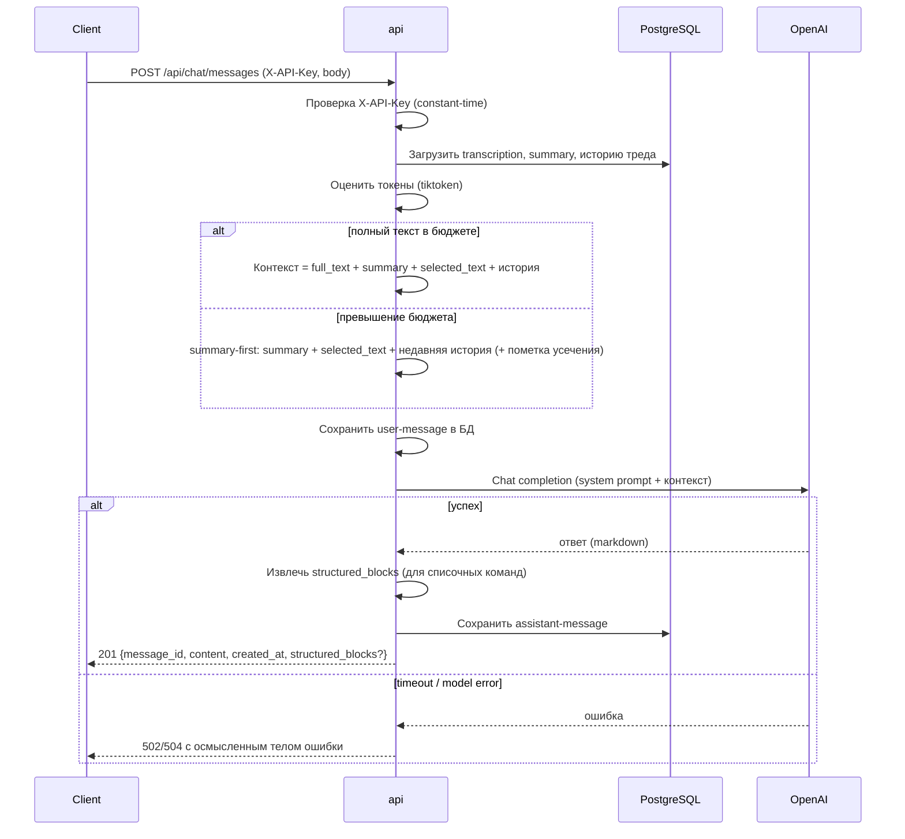

# 01 — Architecture

## Обзор

Монолитный backend-сервис на FastAPI. Развёртывается двумя контейнерами в одном docker-compose: `api` (FastAPI/Uvicorn) и `db` (PostgreSQL). Внешний клиент обращается к API по HTTP с заголовком `X-API-Key`. Сервис обращается к OpenAI API за генерацией ответов. Никаких внешних API за текстом транскрибаций — текст хранится локально в БД.

Решение «монолит вместо сервисов» обосновано в [ADR-001](adr/ADR-001-stack-and-topology.md): размер проекта мал, команда 1–2 человека, простота поддержки приоритетна.

## Компоненты

| Компонент | Ответственность |
|---|---|
| `api` (FastAPI) | HTTP endpoints, аутентификация, валидация (Pydantic v2), оркестрация запроса к LLM, чтение/запись БД |
| `db` (PostgreSQL) | Хранение transcriptions, summaries, chat_messages |
| OpenAI API (внешний) | Генерация ответов LLM |

### Внутренние слои `api`

| Слой | Содержимое |
|---|---|
| Routers | HTTP endpoints (`/api/transcriptions`, `/api/chat/messages`, `/api/transcriptions/{id}/messages`, `/healthz` liveness, `/health` readiness) |
| Schemas | Pydantic v2 модели request/response |
| Services | Бизнес-логика: ingest, построение контекста (summary-first), обращение к OpenAI, сохранение истории |
| Repositories | Доступ к БД через SQLAlchemy 2 (async) |
| Core | Конфиг (.env), auth (X-API-Key), error handlers, логирование, prompt-шаблоны, token-оценка (tiktoken) |

## Deployment topology

Прод — на общем сервере за общим Traefik (терминирует TLS, выпускает Let's Encrypt).
Сервис не публикует портов 80/443. Полная прод-топология, сеть `web`, labels и CI/CD —
в [07-deployment.md](07-deployment.md) и [ADR-006](adr/ADR-006-prod-deploy-shared-traefik.md).

```mermaid
graph LR
    Client[Внешний клиент] -->|HTTPS velunoapp.shop + X-API-Key| TR[Общий Traefik\nTLS / Let's Encrypt]
    TR -->|HTTP :8000 по сети web| API[api: FastAPI/Uvicorn]
    API -->|SQL async| DB[(PostgreSQL)]
    API -->|HTTPS| OpenAI[OpenAI API]

    subgraph SRV [Общий сервер 87.239.135.154]
        TR
        subgraph AICHAT [/opt/aichat - наш сервис]
            API
            DB
        end
    end
```

Traefik живёт в `/opt/edge` (управляется владельцем сервера, мы не трогаем); наш сервис —
в `/opt/aichat`. Связь между ними — общая внешняя docker-сеть `web`.

## Поток главного запроса (POST /api/chat/messages)



## Границы и зависимости

- Сервис не вызывает внешних API за текстом. Источник текста — только собственная БД.
- Единственная внешняя зависимость во время выполнения — OpenAI API.
- Stateless `api` (состояние только в БД), горизонтально масштабируется при необходимости (вне scope v1).

## Конфигурация (из `.env`)

- `API_KEY` — ключ доступа к endpoints.
- `OPENAI_API_KEY` — ключ OpenAI.
- `OPENAI_MODEL` — модель (default см. ADR-002).
- `DATABASE_URL` — строка подключения к PostgreSQL.
- `OPENAI_TIMEOUT_SECONDS`, `CONTEXT_TOKEN_BUDGET`, `MAX_OUTPUT_TOKENS` — см. 02-tech-stack и ADR-002.

Полный список переменных — в [05-security.md](05-security.md) и [07-deployment.md](07-deployment.md).
