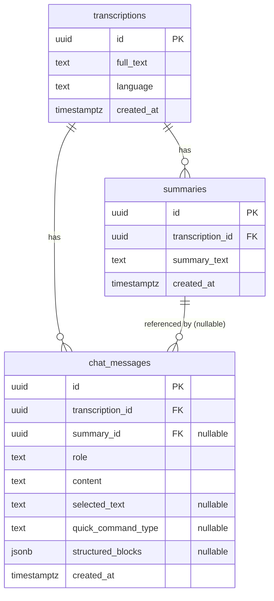

# 03 — Data Model (обзор)

Детальный источник истины по модели данных модуля — [modules/ai-chat/04-data-model.md](modules/ai-chat/04-data-model.md). Здесь — сводный обзор и общая DDL.

## Сущности

## Решения по модели

- **summaries** — отдельная сущность от transcriptions, т.к. ТЗ различает `transcription_id` и `summary_id`, и у транскрибации может быть несколько summary (например, исходная и сгенерированная командой `make_summary`). Для построения контекста по умолчанию используется последняя summary транскрибации, либо явно переданная `summary_id`.
- **chat_messages** — единый тред на транскрибацию (v1): фильтр по `transcription_id`, упорядочивание по `created_at`/`id`. Один тред на транскрибацию — см. [Q-AICHAT-1](modules/ai-chat/99-open-questions.md).
- **role** — `user` | `assistant`. Системный prompt в БД не хранится (константа в коде).
- **structured_blocks** — JSONB, заполняется только для assistant-сообщений списочных команд.
- **PK** — UUID (генерация на стороне БД, `gen_random_uuid()`), чтобы id были непредсказуемыми и пригодными для внешних ссылок.

## DDL (PostgreSQL 16)

Канонический DDL и индексы — в [modules/ai-chat/04-data-model.md](modules/ai-chat/04-data-model.md). Применяется через Alembic-миграции (см. 02-tech-stack).

## Миграции

- Инструмент: **Alembic** (autogenerate + ручная правка).
- Первая миграция создаёт все три таблицы, расширение `pgcrypto` (для `gen_random_uuid()`), индексы и FK.
