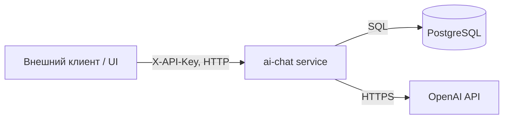

# ai-chat / 01 — Context

## Соседи и зависимости

| Зависимость | Тип | Назначение |
|---|---|---|
| PostgreSQL | внутренняя (контейнер) | Хранение transcriptions, summaries, chat_messages |
| OpenAI API | внешняя | Генерация ответов LLM |
| Внешний клиент | потребитель | Загружает транскрибации, ведёт чат |

## Интеграционные контракты

- **Входящие:** HTTP REST (см. [02-api-contracts.md](02-api-contracts.md)). Аутентификация `X-API-Key`.
- **Исходящие:** OpenAI Chat Completions через официальный клиент `openai`.
- **Текст транскрибаций:** только из собственной БД. Внешних API за текстом нет (зафиксировано в требованиях пользователя).

## События

Событийной интеграции (брокеры, webhooks) в v1 нет — поэтому документ `05-events.md` не создаётся. Всё взаимодействие синхронное по HTTP.

## Данные на входе/выходе

- На входе ingest: `full_text` (обязателен, непустой), `language?`, `summary?`.
- На входе чата: `transcription_id`, `message`, `selected_text?`, `quick_command_type?`, `summary_id?`.
- На выходе чата: markdown `content` + опц. `structured_blocks`.
