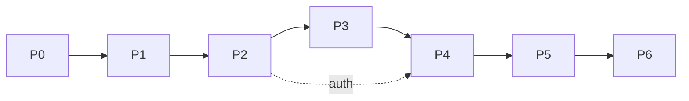

# ai-chat / 07 — Implementation Phases

Последовательность реализации. Каждая фаза должна быть Production ready перед следующей.

## Phase 0 — Скелет проекта (devops/backend)

- `pyproject.toml` (зависимости из [02-tech-stack](../../02-tech-stack.md)), пакет `app/`.
- Конфиг `app/core/config.py` (pydantic-settings, чтение `.env`).
- `app/main.py` (FastAPI app, регистрация роутеров, error handlers, логирование).
- `Dockerfile`, `docker-compose.yml`, `.env.example`, `.dockerignore` (см. [07-deployment](../../07-deployment.md)).
- `GET /health`.
- DoD: `docker compose up` поднимает api+db, `/health` отвечает 200.

## Phase 1 — Модель данных и миграции (backend)

- SQLAlchemy модели transcriptions/summaries/chat_messages.
- Alembic init + первая миграция (DDL из [04-data-model](04-data-model.md)).
- Репозитории доступа.
- DoD: `alembic upgrade head` создаёт схему; репозитории покрыты unit-тестами.

## Phase 2 — Ingest endpoint (backend)

- `POST /api/transcriptions` (+ опц. summary).
- Auth dependency (X-API-Key, constant-time).
- DoD: ingest возвращает id; auth 401; пустой текст 400. Тесты.

## Phase 3 — Контекст и LLM (backend)

- `app/core/tokens.py` (tiktoken), `app/services/context.py` (summary-first, ADR-004).
- `app/core/prompts.py` (системный prompt дословно + command prompts).
- `app/services/llm.py` (OpenAI клиент, таймаут, маппинг ошибок 502/504).
- DoD: unit-тесты context-builder (full/summary_first/truncated/413), token-оценки, error-mapping.

## Phase 4 — Главный endpoint чата (backend)

- `POST /api/chat/messages`: оркестрация, сохранение user/assistant, structured_blocks для списочных команд.
- DoD: интеграционные тесты по acceptance-кейсам из [06-testing-strategy](../../06-testing-strategy.md) (OpenAI замокан).

## Phase 5 — История (backend)

- `GET /api/transcriptions/{id}/messages` с пагинацией и порядком.
- DoD: тесты пагинации/порядка; 404 при отсутствии транскрибации.

## Phase 6 — QA и деплой

- Полный прогон тестов, coverage ≥80%.
- CI (devops), сборка образа, smoke-тест на VPS.
- DoD: пайплайн зелёный, сервис разворачивается одной командой.

## Зависимости фаз

